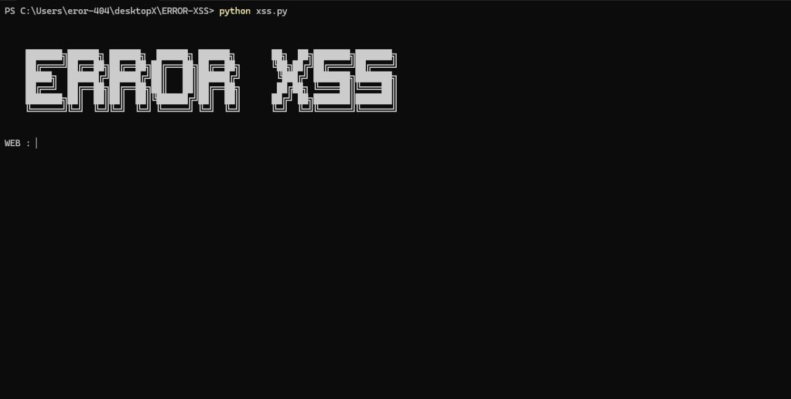

# ERROR-XSS

Simple XSS testing tool designed for educational purposes.

## Features
- Test input fields using multiple XSS payloads
- Run thousands of payloads automatically
- Pause and resume testing anytime
- While paused, you can manually fill other fields and save them

## Usage

Run the tool:
python error_xss.py

Then:
- Enter the target URL
- Select the input field you want to test
- The tool will start testing payloads automatically
